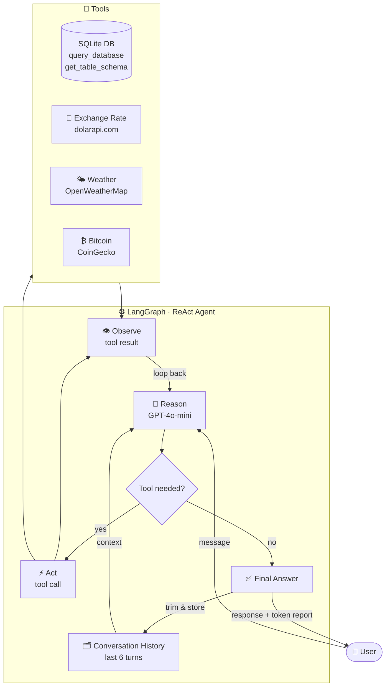

# AI SQL Agent with LangGraph

A conversational AI agent that queries a business database using natural language. Built with LangGraph and OpenAI, containerized with Docker, and deployed on AWS Lambda.

## Architecture



## Features

- Natural language to SQL queries
- ReAct agent loop (Reason → Act → Observe)
- Conversational memory (last 6 turns)
- Real-time exchange rate (dolarapi.com)
- Real-time weather data (OpenWeatherMap)
- Bitcoin price — current and historical (CoinGecko)
- Per-query token usage and cost tracking
- Deployed on AWS Lambda

## Tech Stack

- Python 3.11
- LangGraph + LangChain
- OpenAI GPT-4o-mini
- SQLite
- Docker
- AWS Lambda + ECR

## Local Setup

```bash
git clone https://github.com/ceciagro/ai-agent-demo
cd ai-agent-demo
python3 -m venv venv
source venv/bin/activate
pip install -r requirements.txt
```

## Environment Variables

```bash
export OPENAI_API_KEY="your-openai-api-key"
export OPENWEATHER_API_KEY="your-openweathermap-api-key"
```

## Run Locally

```bash
python3 database.py
python3 sql_agent.py
```

## Deploy to AWS Lambda

```bash
docker buildx build --platform linux/amd64 --push -t YOUR_ECR_URI .
aws lambda update-function-code --function-name ai-agent-demo --image-uri YOUR_ECR_URI
```

## Example Queries

- "How many orders are processing?"
- "Who is the customer with the most orders?"
- "What's the total revenue from delivered orders?"
- "What is the official exchange rate today?"
- "What's the weather in Buenos Aires?"